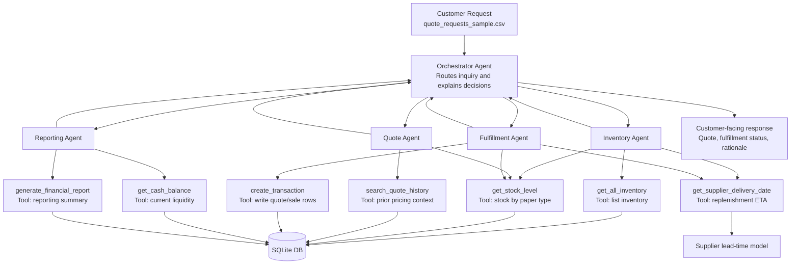

# Agent Workflow Diagram

## Step 1 Draft + Updated Flow

## Agent Responsibilities (Non-overlapping)

- **Orchestrator Agent**: accepts request, sequences worker agents, composes final customer-safe response.
- **Inventory Agent**: answers stock questions and reorder viability (with supplier ETA).
- **Quote Agent**: computes price and discount strategy, references quote history.
- **Fulfillment Agent**: confirms/denies orders, updates records via transaction tools.
- **Reporting Agent**: fetches cash/reporting metrics for explainability and monitoring.

## Tool Mapping to Starter Helper Functions

- `inventory_lookup_tool` -> `get_all_inventory`, `get_stock_level`
- `supplier_timeline_tool` -> `get_supplier_delivery_date`
- `quote_history_tool` -> `search_quote_history`
- `transaction_tool` -> `create_transaction`
- `cash_balance_tool` -> `get_cash_balance`
- `financial_report_tool` -> `generate_financial_report`

This mapping replaces hypothetical tools with concrete helper-function-backed tools from the starter module.
